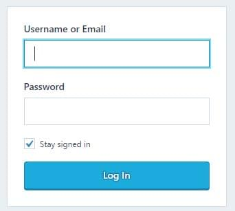
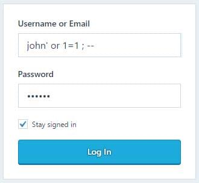

# SQL INJECTION LÀ GÌ?
Trong tất cả các cuộc tấn công nhằm vào website, tấn công SQL Injection là một loại hình nguy hiểm và phổ biến nhất, nó gây ra những thiệt hại đáng kể cho nhiều doanh nghiệp và tổ chức trong những năm qua.

SQL injection – còn được gọi là SQLi – sử dụng những lỗ hổng trong các trường đầu vào (input) của website để nhắm mục tiêu vào cơ sở dữ liệu của ứng dụng web, nơi lưu giữ những thông tin nhạy cảm và có giá trị nhất. Thông qua SQLi kẻ tấn công có thể ăn cắp hoặc xáo trộn dữ liệu, cản trở sự hoạt động của các ứng dụng, và, trong trường hợp xấu nhất, nó có thể chiếm được quyền truy cập quản trị vào máy chủ cơ sở dữ liệu. Dưới đây là những gì bạn cần biết về tấn công SQL Injection và cách bảo vệ website của bạn khỏi chúng.
## 1. Cách thức website bị tấn công SQL Injection

Các cuộc tấn công SQL Injection được thực hiện bằng cách gửi lệnh SQL độc hại đến các máy chủ cơ sở dữ liệu thông qua các yêu cầu của người dùng mà website cho phép. Bất kỳ kênh input nào cũng có thể được sử dụng để gửi các lệnh độc hại, bao gồm các thẻ <input>, chuỗi truy vấn (query strings), cookie và tệp tin.

Để xem cách nó hoạt động, giả sử bạn có một form đăng nhập có 2 input username và password như dưới đây:

Khi người dùng nhập thông tin đăng nhập của họ và nhấn vào nút “log in”, thông tin sẽ được gửi lại cho máy chủ web của bạn, ở đó nó sẽ được kết hợp với một lệnh SQL. Ví dụ, trong PHP, mã sẽ giống như sau:

`$sql_command="select * from users where username = '".$_POST['username'] AND password = '".$_POST['password']."'";`

Lệnh này sau đó sẽ được gửi đến một máy chủ cơ sở dữ liệu và tập dữ liệu kết quả sẽ xác định xem username và password có tương ứng với một tài khoản người dùng hợp lệ hay không. Ví dụ người dùng nhập “john” làm username và “123456” làm password (đừng bao giờ sử dụng mật khẩu này) sẽ chuyển mã trên thành lệnh sau:

`SELECT * FROM users WHERE username='john' AND password='123456'`

Nhưng điều gì sẽ xảy ra nếu người dùng quyết định thử cái khác, chẳng hạn như sau:
Người dùng cố tình thay đổi username và password

Lệnh kết quả sẽ là như sau:

`SELECT * FROM users WHERE username='john' OR 1=1; -- ' AND password='123456'`

Kết quả trả về là thông tin đăng nhập của người dùng có tên là “john” mà không cần mật khẩu chính xác do phần kiểm tra mật khẩu đã bị comment bởi dấu `--` do kẻ tấn công cố tính thêm vào.  
Đây chỉ là một trong những hình thức đơn giản nhất của tấn công SQL Injection. Với một vài thủ thuật, kẻ tấn công có thể thêm tài khoản mới, và xóa hoặc sửa đổi thông tin của các tài khoản người dùng hiện có. Cùng một cách tấn công có thể được sử dụng để lấy cắp các bản hồ sơ và thông tin của người dùng nếu chúng không bị giới hạn cho khách truy cập hoặc để thay đổi nội dung hồ sơ.
Trong các trường hợp nghiêm trọng hơn, khi kết nối với máy chủ cơ sở dữ liệu được thực hiện thông qua tài khoản quản trị (như “root” trong MySQL hoặc “sa” trong MS SQL Server), kẻ tấn công có thể đi sâu vào hệ điều hành của máy chủ. Kẻ tấn công sử dụng lỗ hổng SQL injection để cùng lúc tạo tài khoản người dùng trên máy chủ bị xâm nhập, kích hoạt tính năng Remote Desktop, cài đặt thư mục chia sẻ SMB và tải phần mềm độc hại – ngoài việc làm rối tung mọi thứ đã được lưu trữ trong cơ sở dữ liệu.

## 2. Phân loại SQL Injection
Đây là các loại SQL Injection phổ biến nhất, về cụ thể hãy xem thư mục chi tiết của từng loại.
### UNION-based SQL Injection
### Error-based SQL Injection
### Blind-based SQL Injection
* Boolean-based Blind SQL Injection
* Time-based Blind SQL Injection
* SQL Injection Out-of-band

## 3. Phòng tránh, ngăn chặn SQL Injection
Để ngăn chặn các cuộc tấn công SQL Injection (SQLi), bạn có thể thực hiện một số biện pháp phòng tránh sau đây:

* Sử dụng câu lệnh tham số hóa (Parameterized Queries hoặc Prepared Statements): Thay vì tạo câu truy vấn SQL bằng cách nối chuỗi, bạn nên sử dụng tham số hoá để truyền các giá trị vào câu truy vấn. Điều này giúp tránh được việc nhúng mã SQL độc hại vào câu truy vấn.

* Kiểm tra và sạch dữ liệu đầu vào (Input Validation và Sanitization): Đảm bảo rằng dữ liệu đầu vào từ người dùng được kiểm tra và sạch sẽ trước khi sử dụng trong câu truy vấn SQL. Loại bỏ hoặc làm sạch các ký tự đặc biệt như dấu nháy đơn (') hoặc dấu gạch ngang (--) có thể giúp ngăn chặn các cuộc tấn công SQL Injection.

* Sử dụng các thư viện hoặc framework an toàn: Sử dụng các thư viện hoặc framework có sẵn có tích hợp các phương pháp an toàn để thực hiện các truy vấn SQL, giúp giảm thiểu nguy cơ SQL Injection.

* Giảm quyền truy cập cơ sở dữ liệu: Giảm quyền truy cập của người dùng hoặc ứng dụng đến cơ sở dữ liệu chỉ cần quyền truy cập cần thiết, giúp giảm thiểu tác động của một cuộc tấn công SQL Injection.

* Sử dụng mã hóa dữ liệu: Mã hóa dữ liệu trước khi lưu trữ vào cơ sở dữ liệu có thể giúp bảo vệ dữ liệu người dùng khỏi việc bị chiếm đoạt trong trường hợp xâm nhập cơ sở dữ liệu.

* Thực hiện kiểm thử bảo mật định kỳ: Thực hiện kiểm thử bảo mật định kỳ để phát hiện và khắc phục các lỗ hổng bảo mật, bao gồm cả các lỗ hổng liên quan đến SQL Injection.